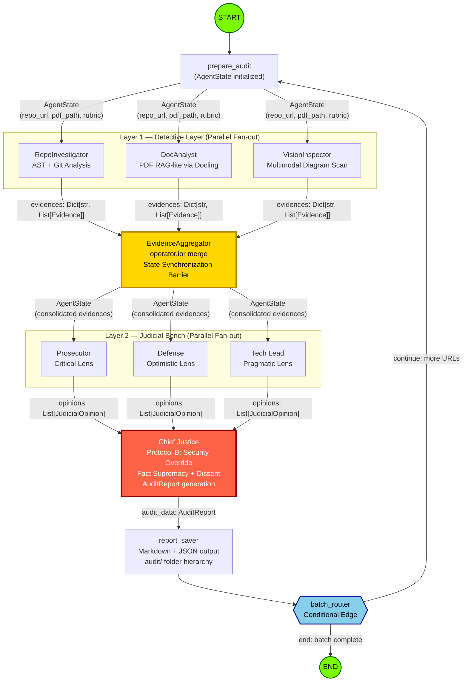
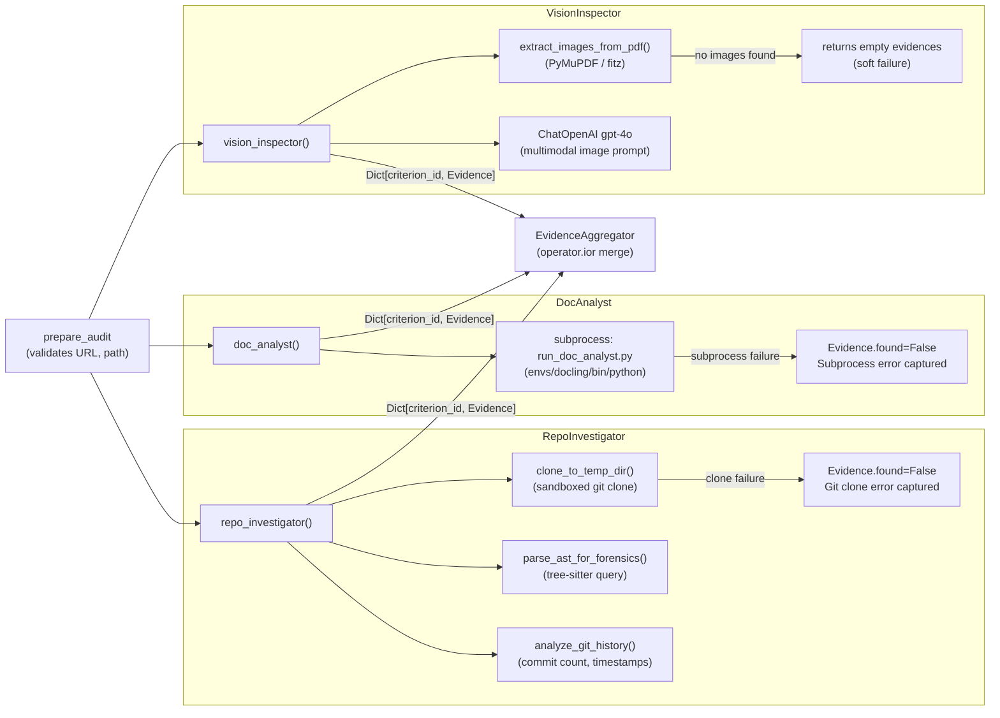
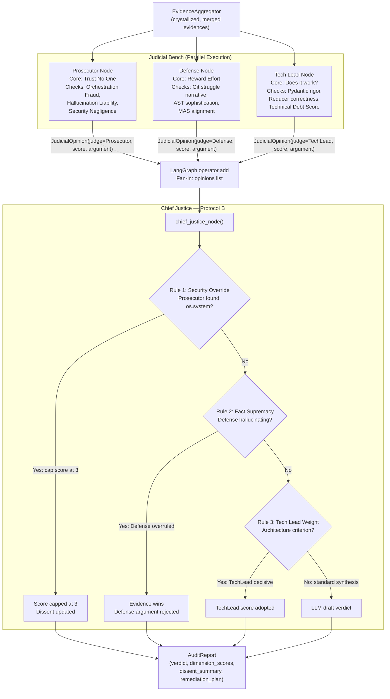

# Automaton Auditor Swarm — Architecture & Engineering Report

> **Project:** Automaton Auditor Swarm
> **Author:** Mamee13
> **Date:** 2026-02-25
> **Phase Completed:** Phase 1-5 (Vision, Refinement, Parallel Orchestration)

---

## 1. System Overview

The Automaton Auditor Swarm is a **hierarchical multi-agent system** built on LangGraph that audits GitHub repositories and PDF reports against a forensic rubric. The architecture is modeled as a **Digital Courtroom**:

- **Layer 1 — Detective Layer**: Three forensic sub-agents (`RepoInvestigator`, `DocAnalyst`, `VisionInspector`) run **in parallel**, each collecting structured `Evidence` objects from distinct artifact types (code, documents, diagrams).
- **Layer 2 — Judicial Layer**: Three judges (`Prosecutor`, `Defense`, `TechLead`) run **in parallel**, each analyzing the same evidence through a distinct adversarial persona, producing `JudicialOpinion` objects.
- **Layer 3 — Supreme Court**: A `ChiefJusticeNode` applies deterministic **Protocol B** synthesis rules and produces the final `AuditReport` in structured Markdown and JSON.

The system supports **batch processing** of up to 3 URLs sequentially via a conditional edge loop, and uses **MemorySaver** for in-memory checkpointing of long-running audits.

---

## 2. Architecture Decision Rationale

### 2.1 Pydantic + TypedDict for State Management

**The Problem Being Solved:** In a parallel multi-agent execution, multiple nodes write to the same shared state object simultaneously. Without a contract enforcing the structure of those writes, two common failure modes emerge:

1. **State Corruption via Type Mismatch** — a node attempting to append a string where a list of `Evidence` objects is expected silently corrupts the downstream aggregation.
2. **Silent Data Loss** — a parallel node overwrites a key with a new value instead of merging, destroying the findings of a previously completed node.

**The Decision:** `Evidence` and `JudicialOpinion` are defined as Pydantic `BaseModel` subclasses. The top-level `AgentState` is a `TypedDict` using `Annotated` type hints with reducer functions:

```python
# src/state.py
class AgentState(TypedDict):
    evidences: Annotated[Dict[str, List[Evidence]], operator.ior]
    opinions:  Annotated[List[JudicialOpinion], operator.add]
```

The `operator.ior` reducer merges evidence dictionaries without overwriting, while `operator.add` concatenates judicial opinion lists. These are **not cosmetic** — they are LangGraph's mechanism for conflict-free state updates during fan-in. Without them, the last detective node to complete would overwrite the results of the other two.

**Why not plain dicts?** A plain `dict` has no schema enforcement. When three detective nodes write to `evidences` at the same time in LangGraph, the framework uses the reducer to merge their outputs. Without a reducer, the last node to complete wins and the others' work is discarded. Without Pydantic, there is no validation that the written data matches the expected schema — a subtle bug in one node would not surface until the Chief Justice node tries to iterate over an unexpected type.

**The Trade-off Acknowledged:** Pydantic introduces serialization overhead and adds a hard dependency. For a small, fast pipeline this might be considered over-engineering. But for a distributed audit swarm where agents can produce structurally different evidence formats (AST tree data, git metadata, PDF text), the schema enforcement is a net win that prevents entire audit runs from being silently corrupt.

**Alternatives Considered and Rejected:**

- **`dataclasses`**: Lacks the field-level validation (e.g., `confidence` must be between 0.0 and 1.0) that Pydantic provides via `Field(ge=0.0, le=1.0)`.
- **Plain `dict`**: Zero runtime type safety. A detective returning `{"confidence": "high"}` (string instead of float) would not surface until a judge node tried to perform arithmetic on it.
- **`TypedDict` only**: Provides type hints for editor assistance but no runtime validation. Pydantic adds runtime validation on top.

---

### 2.2 AST Parsing (tree-sitter) vs. Regex

**The Problem Being Solved:** The `RepoInvestigator` must forensically verify whether a repository actually implements specific LangGraph constructs — not just whether the strings `"StateGraph"` or `"BaseModel"` appear in the codebase. This distinction is critical because "Vibe Coders" often include these terms in comments, dead code, or imports that are never used.

**The Failure Mode Prevented by Regex:** Regex is a lexical tool; it operates on character sequences. Consider this bypass that would fool any regex-based checker:

```python
# We tried StateGraph but decided not to use it
# BaseModel is also considered
AUDIT_NOTES = "Using StateGraph with BaseModel"
```

A regex scan for `StateGraph` would report this as compliant. The actual graph definition could be a flat Python script with no state machine whatsoever.

**The Decision:** The system uses `tree-sitter-python` (`tree_sitter_python`) to build a **Concrete Syntax Tree (CST)** of each Python file. A `Query` is then run against the tree to find:

- `class_definition` nodes (verifying inheritance from `BaseModel`)
- `function_definition` nodes (verifying function signatures)
- Patterns of `add_edge` and `add_node` call expressions to verify graph wiring structure

```python
# src/tools/forensics.py
query = Query(
    PY_LANGUAGE,
    """
    (class_definition (identifier) @class_name)
    (function_definition (identifier) @func_name)
    """,
)
cursor = QueryCursor(query)
captures = cursor.captures(tree.root_node)
```

This approach verifies **semantic intent**, not just lexical presence. `tree-sitter` handles multi-line definitions, decorators, nested classes, and complex string formatting that would cause regex to fail or produce false positives.

**Why tree-sitter over Python's built-in `ast` module?** Python's `ast` module is also a valid choice and was considered. The key differentiator is that `tree-sitter` is language-agnostic and can be extended to parse other file formats (Dockerfiles, YAML) in the future without switching parser frameworks. `tree-sitter` also handles syntactically invalid files more gracefully, returning a partial tree with error nodes rather than raising a `SyntaxError` — which is important when auditing potentially broken student code.

**The Trade-off Acknowledged:** `tree-sitter` requires a compiled native binding (`tree_sitter_python` wheel) while Python's `ast` is part of the Standard Library. This adds a dependency but provides robustness to syntactically broken files and future extensibility.

---

### 2.3 Sandboxing Strategy for Cloning Unknown Repos

**The Problem Being Solved:** The auditor clones and analyzes **arbitrary public repositories from unknown authors**. This introduces a significant set of risks:

1. **Path Traversal / Symlink Attacks** — A malicious repo could contain symlinks pointing outside the clone directory, allowing reads of host filesystem files.
2. **Persistent Pollution** — If a repo is cloned into the live working directory, any files left behind (e.g., a `pyproject.toml`, a `.env`) could interfere with subsequent audit runs or the system's own configuration.
3. **Authentication Credential Leakage** — Naive `os.system('git clone <url>')` can expose SSH keys or tokens in process logs.

**The Decision:** All repository cloning is performed inside a `tempfile.mkdtemp()` directory. The `gitpython` library's `Repo.clone_from` is used instead of `subprocess` calls to raw `git`, which provides structured error handling:

```python
# src/tools/forensics.py
def clone_to_temp_dir(repo_url: str) -> str:
    temp_dir = tempfile.mkdtemp()
    try:
        git.Repo.clone_from(repo_url, temp_dir, depth=1)
        return temp_dir
    except Exception as e:
        shutil.rmtree(temp_dir, ignore_errors=True)
        raise RuntimeError(f"Failed to clone repository: {str(e)}")
```

`depth=1` performs a **shallow clone**, fetching only the latest commit. This limits disk usage and reduces attack surface by not pulling the full history locally.

**Why not `os.system`?** `os.system('git clone <url>')` passes the command to a shell, enabling shell injection attacks if the URL is not sanitized. A URL like `https://github.com/foo/bar; rm -rf /` would execute the `rm` command on the host. `gitpython` calls the git binary directly, bypassing the shell entirely.

**Why not Docker or container sandboxing?** Full container isolation would be the ideal security posture but introduces significant operational overhead (Docker daemon dependency, image build time). `tempfile` + `gitpython` achieves the primary goals of filesystem isolation and identity separation with minimal infrastructure requirements. A future Phase 6 item is to wrap this in a full Docker-in-Docker execution context.

**The Trade-off Acknowledged:** `tempfile.mkdtemp()` creates a directory in the OS temp folder but does **not** automatically clean it up on success — `TemporaryDirectory()` (context manager) would handle cleanup automatically. The current implementation intentionally keeps the temp dir alive for the duration of the audit run so all three detective nodes can read from the same clone. Manual cleanup or a context-manager refactor remains in the forward plan.

---

### 2.4 RAG-lite Approach for PDF Ingestion

**The Problem Being Solved:** A submitted PDF report can be 10-30 pages. Dumping the entire text into an LLM context window has two drawbacks:

1. **Context Window Saturation** — Long documents push critical evidence narratives out of the model's attention window.
2. **Cost & Latency** — Sending 30 pages of text to `gpt-4o` on every audit run is expensive and slow.

**The Decision:** The `DocAnalyst` node implements a **RAG-lite** approach via an isolated subprocess. Instead of loading the full PDF into context, the `run_doc_analyst.py` runner (executed in the `envs/docling` environment) uses `Docling` to:

1. Parse the PDF into structured Markdown chunks.
2. Perform keyword and semantic search for specific forensic targets (e.g., "Dialectical Synthesis", "Fan-Out", "StateGraph").
3. Return only the relevant excerpts as JSON to the orchestration layer.

**Why a separate `envs/docling` environment?** `Docling` depends on PyTorch and ML libraries (`transformers`, potentially CUDA) which conflict with the lightweight `LangGraph` + `langchain-openai` dependency set of the core orchestration layer. Mixing them in one environment creates version conflicts that are impossible to resolve cleanly. The subprocess isolation pattern allows each environment to maintain its own dependency graph:

```
Core Env (envs/core):       LangGraph, langchain-openai, gitpython, tree-sitter
Docling Env (envs/docling): docling, torch, transformers
```

The `doc_analyst` node invokes the runner via `subprocess.run`, capturing structured output via `stdout` as JSON:

```python
# src/nodes/detectives.py
result = subprocess.run(
    ["envs/docling/bin/python", runner, pdf_path],
    capture_output=True, check=True, text=True,
)
doc_data = json.loads(result.stdout)
```

**Alternatives Considered and Rejected:**

- **Full PDF dump**: Too expensive and causes context saturation.
- **Single venv with all dependencies**: Causes irresolvable dependency conflicts between ML libs and LangGraph.
- **HTTP microservice for DocAnalyst**: The correct long-term solution but adds significant operational complexity for a Week 2 deliverable.

---

### 2.5 Environment Isolation: Dual `uv` Environments

**The Decision:** The project uses `uv` (a Rust-based Python package manager) rather than `pip` + `venv`. Two environments are managed:

- `envs/core` — The orchestration layer.
- `envs/docling` — The ML-heavy document processing layer.

**Why `uv` over standard `pip`?** `uv` resolves dependencies an order of magnitude faster and produces a lockfile (`uv.lock`) that guarantees reproducible installations across different machines. This is critical for a forensic auditing system — the tool itself must be deterministic. A forensic auditor that produces different results depending on which version of a transitive dependency happens to be installed is not a reliable evaluator.

---

### 2.6 LLM Provider & Temperature Choices

**The Decision:** All judge nodes and the Chief Justice use `ChatOpenAI(model="gpt-4o", temperature=0)`. The VisionInspector also uses `gpt-4o` for multimodal capabilities.

**Why `gpt-4o`?** The judicial reasoning task requires the model to:

- Follow complex persona constraints (Prosecutor vs. Defense bias)
- Return structured JSON that validates against the `JudicialOpinion` schema
- Cite specific evidence IDs from a provided evidence dictionary

Smaller models (e.g., `gpt-3.5-turbo`) were considered and rejected because they fail to maintain persona differentiation across long evidence summaries — they tend to "drift" toward a generic summarizer that ignores the adversarial instruction.

**Why `temperature=0` for Judges and `temperature=0.1` for Chief Justice?** Judicial scoring must be **deterministic** — running the same audit twice with the same evidence should produce the same score. `temperature=0` eliminates sampling randomness in the judge nodes. The Chief Justice uses `temperature=0.1` to allow slight variation in the narrative framing of the `dissent_summary`, which reads more naturally than a fully deterministic string.

---

### 2.7 Dialectical Synthesis vs. Single-Judge Models

**The Problem Being Solved:** A single "Grader" LLM is vulnerable to **sycophancy** — the tendency to award higher scores to well-written reports even if the underlying code is absent, and to award lower scores to poorly-written prose even if the code is excellent.

**The Decision:** Three judges with **hardcoded adversarial personas** analyze the same evidence independently:

- `Prosecutor` — Instructed to assume "Vibe Coding" and look for technical fraud.
- `Defense` — Instructed to find effort and intent, rewarding the spirit of implementation.
- `TechLead` — Instructed to evaluate pragmatic maintainability, ignoring both prose quality and effort.

Their opinions are collected into `List[JudicialOpinion]` via the `operator.add` reducer. The `ChiefJusticeNode` then applies **four hardcoded Protocol B rules** to resolve disagreements deterministically:

1. **Security Override** — The Prosecutor's confirmed security vulnerability (`os.system` without sanitization) caps any criterion score at 3, regardless of Defense arguments.
2. **Fact Supremacy** — If Defense claims a feature exists but `RepoInvestigator` evidence proves the file does not exist, Defense is overruled.
3. **Tech Lead Weight** — For architecture criteria, the TechLead's opinion carries the highest weight.
4. **Dissent Requirement** — The final report must always include a summary of why the Prosecutor and Defense disagreed.

These are not LLM-decided rules — they are Python `if/else` blocks in `justice.py` that run after the LLM synthesizes a draft verdict and can override it.

---

## 3. StateGraph Architecture Diagrams

### 3.1 Full System Flow (with State Types)

This diagram shows the complete end-to-end execution path including state types flowing between layers, the synchronization node, and the conditional batch routing edge.



---

### 3.2 Parallel Detective Layer (Detailed)

This diagram zooms into the Detective fan-out/fan-in, showing the tools each detective uses and the error handling path.



---

### 3.3 Parallel Judicial Layer (Detailed)

This diagram shows the judicial fan-out, the persona-specific reasoning paths, and the deterministic Protocol B override executed by the Chief Justice.



---

## 4. Gap Analysis & Forward Plan

> **Honesty note:** This section is a genuine self-assessment. Not everything described in the MASTER_PLAN is production-complete. The items below are specific, sequenced, and actionable — sufficient for another engineer to pick up the work.

### 4.1 Current Status of Each Layer

| Layer              | Component                  |   Status    | Notes                                                                         |
| :----------------- | :------------------------- | :---------: | :---------------------------------------------------------------------------- |
| **Detective**      | `RepoInvestigator`         |  Complete   | AST + Git + sandboxed clone                                                   |
| **Detective**      | `DocAnalyst`               |   Partial   | Subprocess bridge works; `run_doc_analyst.py` runner needs RAG chunking logic |
| **Detective**      | `VisionInspector`          |  Complete   | PyMuPDF extraction + GPT-4o vision analysis                                   |
| **Judicial**       | `Prosecutor`               |  Complete   | Distinct persona prompt, Pydantic output                                      |
| **Judicial**       | `Defense`                  |  Complete   | Distinct persona prompt, Pydantic output                                      |
| **Judicial**       | `TechLead`                 |  Complete   | Distinct persona prompt, Pydantic output                                      |
| **Synthesis**      | `ChiefJusticeNode`         |  Complete   | Protocol B hardcoded rules, dissent requirement                               |
| **Synthesis**      | Variance Re-evaluation     |   Missing   | No explicit loop for score variance > 2                                       |
| **Infrastructure** | `batch_router`             |  Complete   | Conditional loop for multiple URLs                                            |
| **Infrastructure** | `MemorySaver` checkpointer |  Complete   | In-memory state persistence                                                   |
| **Infrastructure** | `Dockerfile`               | Not started | Phase 5 deliverable                                                           |
| **Evidence**       | Self-audit run             | Not started | Phase 6 deliverable                                                           |
| **Evidence**       | Peer-audit run             | Not started | Phase 6 deliverable                                                           |

---

### 4.2 Residual Engineering Work

#### Item R-1: DocAnalyst RAG Chunking (`runners/run_doc_analyst.py`)

**What is missing:** The `run_doc_analyst.py` runner currently invokes Docling's PDF parser but does not implement semantic chunking or keyword-targeted extraction. It returns a flat text dump.

**What is needed:**

1. Chunk the Docling output into approximately 500-token segments.
2. For each forensic target keyword (e.g., "Dialectical Synthesis", "Fan-Out", "State Reducers"), run a semantic similarity search over the chunks.
3. Return only the top-3 relevant chunks per keyword as structured JSON.

**Why this matters:** Without chunking, the entire PDF text is passed to the judge nodes as a single evidence string. This will hit context limits for long reports and produces lower-quality judicial reasoning since the model cannot focus on the specific claim being verified.

---

#### Item R-2: Score Variance Re-evaluation Loop

**What is missing:** Per the challenge spec, if the score variance between judges exceeds 2 points (e.g., Prosecutor scores 1, Defense scores 5), the system should trigger a re-evaluation of the specific evidence before the Chief Justice issues a final verdict. Currently, the Chief Justice receives all three opinions but cannot request re-examination.

**What is needed:**

1. Add a `variance_check` conditional edge after the Judicial fan-in.
2. If `max(scores) - min(scores) > 2` for any criterion, route back to a `ReEvaluationNode`.
3. `ReEvaluationNode` prompts the disagreeing judges with the specific evidence that caused the variance and asks for a revised opinion with explicit justification.
4. After re-evaluation, re-enter the Chief Justice node.

**Specific failure mode this prevents:** The Prosecutor scores secure sandboxing as 1 (because it only checked for `os.system` calls without reading the full `clone_to_temp_dir` implementation), while Defense scores it 5 (having read the docstring). A re-evaluation step forces the Prosecutor to confirm or retract based on the actual function implementation rather than surface-level pattern matching.

---

#### Item R-3: Evidence Cross-Reference in Aggregator

**What is missing:** The `EvidenceAggregator` currently does a passive merge (`operator.ior`). It does not detect **Evidence Conflicts** — cases where `DocAnalyst` claims a file exists (the report mentions it) but `RepoInvestigator` evidence shows the file is absent.

**What is needed:**

1. After the merge, iterate over evidence keys.
2. For any criterion where `doc` evidence says `found=True` and `code` evidence says `found=False`, generate a `CONFLICT` metadata flag on the affected evidence objects.
3. Pass these flagged conflicts to the Chief Justice as explicit "Hallucination candidates."

**Why this matters:** The Chief Justice's Fact Supremacy rule currently depends on the Prosecutor to flag hallucinations. Making conflict detection deterministic (not LLM-dependent) prevents hallucinations from slipping through if the Prosecutor's prompt focuses on a different aspect of the evidence.

---

#### Item R-4: Dockerfile & Containerized Runtime

**What is missing:** The `Dockerfile` is listed in the MASTER_PLAN but has not been started.

**What is needed:**

- Multi-stage build: Stage 1 installs `uv`, Stage 2 copies only the `core` environment dependencies, Stage 3 copies the `docling` environment.
- The two environments must be baked into the image at their expected paths (`envs/core`, `envs/docling`) so the subprocess bridge works identically inside the container.
- An entrypoint that accepts `REPO_URL` and `PDF_PATH` as environment variables and invokes `main.py`.

---

### 4.3 Risks, Failure Modes & Mitigations

| Risk                              | Specific Failure Mode                                                                                                                                                    | Mitigation                                                                                                                                                                                                                                                                       |
| :-------------------------------- | :----------------------------------------------------------------------------------------------------------------------------------------------------------------------- | :------------------------------------------------------------------------------------------------------------------------------------------------------------------------------------------------------------------------------------------------------------------------------- |
| **Persona Collusion**             | GPT-4o tends to converge to a moderate opinion despite adversarial prompts, causing Prosecutor and Defense to agree (Score: 3, 3, 3), defeating the dialectical purpose. | Add explicit contrastive instruction: "You must find at least one failing element. A score of 5 is never acceptable unless you can prove no failure mode exists." Also add a validation step that checks if Prosecutor scored higher than Defense and rejects the opinion if so. |
| **Context Window Overflow**       | Large repos with many Python files produce AST reports exceeding 50k tokens when concatenated for judge prompts.                                                         | Implement evidence distillation in the `EvidenceAggregator`: summarize AST output into a high-level signature (class names, function names, edge definitions) before passing to judges.                                                                                          |
| **Subprocess Fragility**          | The `envs/docling` environment may not exist on the host machine, causing `DocAnalyst` to fail silently.                                                                 | Add a preflight check in `prepare_audit` that verifies the docling binary exists. If not, return a `DocAnalyst: unavailable` evidence with `found=False` and `confidence=0.0` so downstream judges are aware.                                                                    |
| **Structured Output Failure**     | `PydanticOutputParser` can fail if the LLM wraps JSON in markdown code fences or adds trailing commentary.                                                               | Switch to `model.with_structured_output(JudicialOpinion)` which uses function calling / JSON mode at the API level, eliminating parser-level failures. This is strictly more reliable than prompt-based JSON extraction.                                                         |
| **Shallow Clone Missing History** | `depth=1` in `clone_to_temp_dir` means `analyze_git_history` cannot reconstruct the full commit narrative for the Defense "struggle and iteration" argument.             | Pass `depth` as a configurable parameter. For Git forensics, use `depth=50` to capture meaningful history while still avoiding full clone overhead.                                                                                                                              |

---

### 4.4 Sequenced Implementation Roadmap

The following is a priority-sequenced plan that another engineer could pick up and execute:

```
SPRINT 1 (Infrastructure & Reliability)
├── R-4: Dockerfile (3-4 days)
│   └── Prerequisite: None. Must be done before peer audit runs.
└── R-3: Evidence Aggregator Conflict Detection (1 day)
    └── Prerequisite: None. Low risk, high correctness value.

SPRINT 2 (Correctness & Quality)
├── R-1: DocAnalyst RAG Chunking (2 days)
│   └── Prerequisite: Basic Dockerfile for docling env portability.
└── Structured Output Fix (0.5 days)
    └── Switch PydanticOutputParser to .with_structured_output()

SPRINT 3 (Advanced Orchestration)
├── R-2: Score Variance Re-evaluation Loop (3 days)
│   └── Prerequisite: All judge nodes producing reliable output (Sprint 2 done).
└── Phase 6: Self-audit + Peer audit runs (1-2 days)
    └── Prerequisite: Full pipeline working reliably.
```

---

## 5. Verification & Testing Plan

### Automated Test Coverage

The test suite in `tests/` covers:

- `test_forensics.py` — Unit tests for `parse_ast_for_forensics`, `clone_to_temp_dir`, and `analyze_git_history`. Verifies that the AST extractor correctly identifies class names and that temp dir cleanup works.
- `test_state.py` — Validates `operator.ior` and `operator.add` reducer behavior under simulated parallel writes.
- `test_judges.py` — Mocks the OpenAI client; verifies each judge node returns a valid `JudicialOpinion` Pydantic model.

### Integration Test Plan

1. **Audit Self**: Run the swarm against the `automaton-auditor-swarm` repo itself. Expected output: High scores across all criteria, confirming the system can find its own Pydantic models, AST tools, and parallel graph structure.
2. **Audit a Known-Failing Repo**: Run against a repo with a linear `StateGraph` (no fan-out). Expected output: Prosecutor charges "Orchestration Fraud," LangGraph Architecture score at or below 1.
3. **Audit a Hallucinating Report**: Feed a PDF that claims `src/advanced_judges.py` exists against a repo where it does not. Expected output: `DocAnalyst` flags it; Chief Justice applies Fact Supremacy override; final score penalized.

### Manual Verification

- **LangSmith Trace Review**: Inspect the judicial debate traces to confirm Prosecutor and Defense produce genuinely different scores on the same criterion — not near-identical reasoning that happens to use different words.
- **Remediation Plan Spot Check**: Verify the generated `remediation_plan` in the `AuditReport` contains specific file-level instructions (e.g., "In `src/graph.py`, line 41, replace the sequential edge with a parallel fan-out") rather than generic advice.

---
