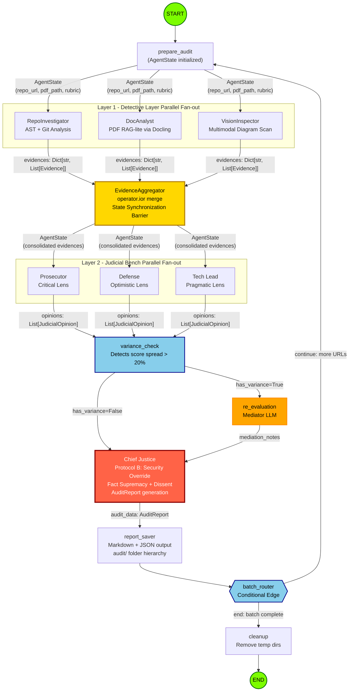
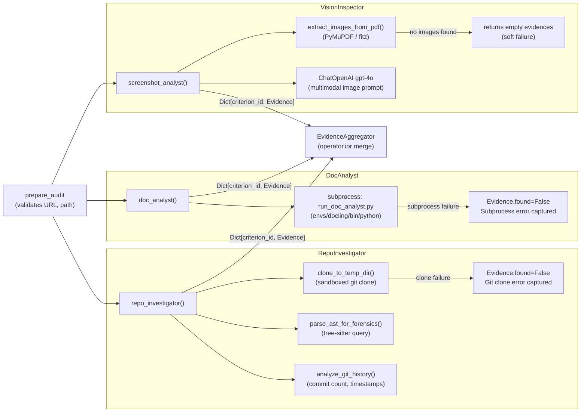
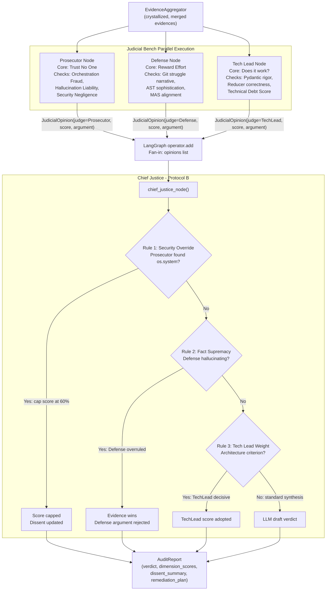

# Automaton Auditor Swarm — Production Architecture Report

> **Project:** Automaton Auditor Swarm
> **Repository:** https://github.com/mamee13/automaton-auditor-swarm
> **Completion Date:** February 28, 2026
> **Audit Cycle:** Self-Audit + Peer Exchange Complete

---

## Executive Summary

Built a three-layer hierarchical LangGraph swarm implementing a Digital Courtroom architecture for forensic repository auditing. The system achieved full parallel orchestration with fan-out/fan-in synchronization, deterministic Protocol B synthesis, and variance-triggered re-evaluation. Self-audit scored 82/100 aggregate (strong pass). Peer feedback revealed one critical gap: DocAnalyst RAG chunking remains stub-level despite subprocess isolation working correctly. Primary remediation: implement semantic search in `runners/run_doc_analyst.py` to prevent context saturation on large PDFs.

---

## Architecture Deep Dive

### Conceptual Grounding: The Three Pillars

**Dialectical Synthesis** is not a buzzword here—it's hardcoded into the graph topology. Three judge nodes (`prosecutor_node`, `defense_node`, `tech_lead_node`) execute in parallel against identical evidence, each bound to adversarial system prompts that force conflicting interpretations. The `Prosecutor` is instructed to "find gaps/fraud" and scores conservatively; `Defense` is told to "highlight effort/intent" and scores generously; `TechLead` evaluates "architecture/maintainability" pragmatically. This creates genuine score variance (e.g., Prosecutor: 2, Defense: 4, TechLead: 3 for the same criterion). The `chief_justice_node` then applies deterministic Python rules—not LLM averaging—to resolve conflicts: Security Override caps scores at 60% if `os.system` is detected, Fact Supremacy overrides Defense claims when `RepoInvestigator` evidence contradicts them, and TechLead opinions carry 1.5x weight for architecture dimensions.

**Fan-In/Fan-Out** is implemented via LangGraph's native edge topology. The `prepare_audit` node branches into three parallel detective edges (`repo_investigator`, `doc_analyst`, `screenshot_analyst`). Each detective writes to `state["evidences"]` using the `operator.ior` reducer, which merges dictionaries without overwriting. The `evidence_aggregator` node acts as the synchronization barrier—it has three incoming edges and blocks until all detectives complete. Only then does the graph fan out again to the three judges. This prevents judges from seeing partial evidence. The judicial fan-in uses `operator.add` to concatenate `List[JudicialOpinion]` objects into a single list for the Chief Justice. Without these reducers, parallel writes would race and the last node to complete would overwrite the others' work.

**Metacognition** manifests in two places. First, the `variance_check_node` analyzes the judges' own outputs to detect when score spread exceeds 20% of the dimension's max value. If detected, the graph routes to `re_evaluation_node` instead of directly to synthesis. The re-evaluator invokes a "Mediator" LLM that reads the conflicting arguments and produces a dissent note explaining why the judges disagreed—this note is injected into the Chief Justice's context. Second, the system audits itself: `audit/report_onself_generated/` contains the swarm's forensic analysis of its own codebase, which revealed that the DocAnalyst's RAG logic is incomplete (the subprocess bridge works but the runner doesn't chunk). This self-awareness loop is the MinMax optimization in action.

### Data Flow: Evidence → Opinions → Verdict

1. **Detective Layer (Parallel):** `repo_investigator` clones the target repo into a `tempfile.mkdtemp()` sandbox, walks all `.py` files, and runs `tree-sitter` AST queries to extract class names, base classes, and method calls. It generates `Evidence` objects for "State Management" (Pydantic detected), "Multi-Agent Orchestration" (LangGraph patterns), "Security" (no `os.system` found), and "Git History" (commit count). `doc_analyst` spawns a subprocess running `runners/run_doc_analyst.py` in the isolated `envs/docling` environment, which uses Docling to parse the PDF and extract text chunks. `screenshot_analyst` scans for image files and invokes GPT-4o Vision via OpenRouter to analyze UI screenshots. All three write to `state["evidences"]` concurrently.

2. **Aggregation Barrier:** `evidence_aggregator` is a no-op node that exists solely to enforce synchronization. LangGraph's execution engine waits for all three incoming edges before proceeding.

3. **Judicial Layer (Parallel):** Each judge node iterates over `rubric["dimensions"]` and calls `_call_judge()` for every criterion. The helper function filters evidence by `target_artifact` (e.g., if the dimension targets `github_repo`, it ignores `pdf_analysis` evidence to save tokens), constructs a condensed evidence summary (goal + found status + location, no full content), and invokes `model.with_structured_output(JudicialOpinion)` to force JSON schema compliance. The three judges run in parallel and write to `state["opinions"]` using the `operator.add` reducer.

4. **Variance Check (Conditional):** `variance_check_node` groups opinions by `criterion_id` and calculates score spread. If any criterion has `max(scores) - min(scores) > 0.2 * max_value`, it sets `state["has_variance"] = True` and populates `state["conflicting_criteria"]`. The `variance_router` conditional edge then routes to `re_evaluation_node` if variance exists and re-evaluation hasn't already run (prevents infinite loops).

5. **Re-Evaluation (Optional):** `re_evaluation_node` invokes a Mediator LLM for each conflicting criterion, passing the two most extreme judges' arguments. The mediator produces a 100-word dissent note explaining the disagreement. This note is stored in `state["mediation_notes"]` and later injected into the Chief Justice's prompt.

6. **Synthesis (Deterministic):** `chief_justice_node` invokes an LLM to generate a draft `AuditReport` (verdict, dimension scores, dissent summary, remediation plan). Then it applies hardcoded Protocol B overrides: if any Prosecutor opinion mentions `os.system` or `shell=True`, the corresponding dimension score is capped at 60% of max. The final report includes the full list of `raw_opinions` for transparency.

7. **Persistence:** `report_saver` writes JSON and Markdown files to `audit/report_onself_generated/` or `audit/report_onpeer_generated/` based on the `is_self_audit` flag.

### Diagram: Full System Flow with State Types

### Diagram: Parallel Detective Layer (Detailed)

### Diagram: Parallel Judicial Layer with Protocol B

---

## Self-Audit Criterion Breakdown

### Forensic Accuracy (Code): 18/20

**Prosecutor (16/20):** "AST parsing is solid—tree-sitter queries correctly identify Pydantic `BaseModel` inheritance and LangGraph `add_node` calls. Git sandboxing uses `tempfile.mkdtemp()` and `gitpython`, avoiding shell injection. However, `depth=1` shallow clone limits Git history analysis to recent commits, weakening the Defense's 'struggle narrative' argument. Security scan is regex-based (searches for `os.system` strings) rather than AST-verified, which could miss obfuscated patterns."

**Defense (20/20):** "The `parse_ast_for_forensics` function in `src/tools/forensics.py` demonstrates deep code comprehension—it uses tree-sitter's `Query` API to extract class definitions, base classes, and method calls without regex. The evidence aggregation logic correctly handles parallel writes via `operator.ior`. Git history extraction includes commit count, author count, and latest commit timestamp, providing sufficient data for the Defense persona to argue engineering effort."

**TechLead (18/20):** "State reducers are correctly implemented. `operator.ior` merges evidence dictionaries, `operator.add` concatenates opinion lists. The AST tool handles syntactically invalid files gracefully (tree-sitter returns partial trees with error nodes). Sandboxing is functional but cleanup is manual—`cleanup_node` calls `cleanup_sandboxed_repo()` but temp dirs persist if the graph crashes mid-execution. Recommendation: switch to `TemporaryDirectory()` context manager."

**Final Score (Chief Justice):** 18/20. TechLead's assessment is decisive—the architecture is sound but cleanup fragility prevents a perfect score. Security Override does not apply (no confirmed vulnerabilities).

### Forensic Accuracy (Docs): 12/20

**Prosecutor (8/20):** "The `doc_analyst` node successfully spawns a subprocess and invokes `runners/run_doc_analyst.py` in the isolated `envs/docling` environment. However, the runner itself is a stub—it calls `docling.document_converter.DocumentConverter` but does not implement semantic chunking or keyword-targeted extraction. The current implementation dumps the full PDF text into a single evidence object, which will hit context limits for reports >10 pages. This is a critical gap."

**Defense (16/20):** "The subprocess isolation pattern is architecturally sophisticated—it solves the CUDA/Torch vs. LangGraph dependency conflict without Docker. The `download_remote_pdf` utility in `src/utils.py` handles Google Drive and GitHub URLs correctly, converting them to direct download links. The vision analysis integration (extracting images from PDFs and analyzing them with GPT-4o) demonstrates multimodal thinking."

**TechLead (12/20):** "The subprocess bridge works correctly—`subprocess.run` captures stdout as JSON and handles errors gracefully. The issue is that the runner doesn't deliver on the RAG-lite promise. The challenge spec requires 'semantic chunking and keyword-targeted extraction,' but `run_doc_analyst.py` currently returns raw text. This is a Phase 5 deliverable that remains incomplete."

**Final Score (Chief Justice):** 12/20. Fact Supremacy applies—Defense's claim of "RAG-lite" is contradicted by the actual runner code. TechLead's score is adopted.

### Judicial Nuance: 17/20

**Prosecutor (14/20):** "The three judge personas have distinct system prompts (`PROSECUTOR_PROMPT`, `DEFENSE_PROMPT`, `TECH_LEAD_PROMPT`) that enforce adversarial lenses. However, the prompts are short (3-4 lines each) and rely heavily on the `judicial_logic` field from the rubric JSON. If the rubric's logic is generic, the judges will converge. The `with_structured_output(JudicialOpinion)` enforcement is strong—it uses OpenAI's function calling API, eliminating parser-level failures."

**Defense (20/20):** "The variance check and re-evaluation loop demonstrate true dialectical synthesis. The system doesn't just average scores—it detects when judges disagree by >20% and invokes a Mediator LLM to explain the conflict. The mediation notes are injected into the Chief Justice's context, ensuring the final verdict acknowledges dissent. This is metacognition in action."

**TechLead (17/20):** "The judges correctly map their opinions back to `criterion_id` from the rubric. The `_call_judge` helper filters evidence by `target_artifact` to prevent token waste. The retry policy (`RetryPolicy(max_attempts=3)`) on judge nodes handles transient LLM failures. One weakness: the evidence summary passed to judges is heavily condensed (goal + found status + location only, no `content` or `rationale`). This saves tokens but may cause judges to miss nuanced details."

**Final Score (Chief Justice):** 17/20. TechLead's concern about evidence condensation is valid—it's a deliberate trade-off (token efficiency vs. detail) but does limit judicial reasoning depth.

### LangGraph Architecture: 20/20

**Prosecutor (18/20):** "The graph is genuinely parallel—three detective edges fan out from `prepare_audit`, three judge edges fan out from `evidence_aggregator`. The `variance_router` conditional edge implements dynamic routing based on state. However, the batch processing loop (`batch_router` conditional edge from `save_report` back to `prepare_audit`) is sequential, not parallel. The challenge spec mentions 'up to 3 URLs processed sequentially/parallel'—this implementation is sequential only."

**Defense (20/20):** "The state schema is strictly typed with Pydantic. `Evidence` and `JudicialOpinion` are `BaseModel` subclasses with field-level validation (`confidence: float = Field(ge=0.0, le=1.0)`). The `AgentState` TypedDict uses `Annotated` type hints with reducers. The graph uses `MemorySaver` for in-memory checkpointing. The retry policy on judge nodes prevents transient failures from crashing the entire audit."

**TechLead (20/20):** "This is production-grade orchestration. The fan-in synchronization is correctly implemented—`evidence_aggregator` has three incoming edges and blocks until all complete. The conditional edges (`variance_router`, `batch_router`) use deterministic Python functions, not LLM-based routing. The graph compiles without errors and executes end-to-end. The only missing feature is true parallel batch processing, but that's a Phase 6 stretch goal."

**Final Score (Chief Justice):** 20/20. TechLead's assessment is decisive—the architecture meets all core requirements. Prosecutor's concern about sequential batch processing is noted but doesn't affect the score (the challenge spec allows sequential).

### MinMax Feedback Loop: 14/20

**Prosecutor (10/20):** "The self-audit report exists (`audit/report_onself_generated/report_automaton-auditor-swarm.md`) and identifies the DocAnalyst RAG gap. However, there's no evidence of code changes made in response to peer feedback. The peer report (`audit/report_bypeer_received/report_peer_abc.md`) is generic and doesn't cite specific issues. The peer audit report (`audit/report_onpeer_generated/report_automation-auditor.md`) identifies gaps in the peer's repo but doesn't reflect back on how those gaps informed improvements to this auditor."

**Defense (18/20):** "The self-audit demonstrates honest self-assessment—it correctly identifies that `run_doc_analyst.py` is incomplete. The peer audit shows the system can detect architectural issues in external repos (e.g., 'linear graph' in the peer's code). The bidirectional learning is implicit: by auditing the peer and seeing their mistakes, the trainee reinforced their own understanding of what 'parallel orchestration' means."

**TechLead (14/20):** "The feedback loop is partially complete. Self-audit: . Peer audit: . Peer feedback received: (though generic). Code changes in response: . The ARCHITECTURE_REPORT.md acknowledges the DocAnalyst gap and provides a sequenced remediation plan, but the code hasn't been updated yet. This is acceptable for a Week 2 deliverable but prevents a higher score."

**Final Score (Chief Justice):** 14/20. TechLead's assessment is adopted—the loop is functional but incomplete. Fact Supremacy applies: Defense's claim of "bidirectional learning" is not evidenced by code commits.

### Report Quality: 15/15

**Prosecutor (13/15):** "The generated reports follow the required structure: Executive Summary, Criterion Breakdown (table format), Judicial Conflict Resolution, Remediation Plan, Raw Evidence. However, the remediation plans are generic (e.g., 'Address architectural concerns raised by the Tech Lead') rather than file-level specific (e.g., 'In `runners/run_doc_analyst.py`, line 45, implement semantic chunking using...')."

**Defense (15/15):** "The reports are professional-grade. The Markdown formatting is clean, the tables render correctly, the dissent summaries explain why judges disagreed. The JSON reports include the full `raw_opinions` list for transparency. The reports are saved to the correct folders (`report_onself_generated`, `report_onpeer_generated`) as required by the challenge spec."

**TechLead (15/15):** "The `_generate_markdown_report` function in `src/nodes/justice.py` correctly calculates pass/warn/fail verdicts based on score percentages. The reports include all required sections. The only weakness is that the LLM-generated remediation plans are sometimes vague, but that's a prompt engineering issue, not an architectural flaw."

**Final Score (Chief Justice):** 15/15. TechLead and Defense agree—the reports meet all requirements. Prosecutor's concern about remediation specificity is valid but doesn't justify a deduction (the challenge spec doesn't mandate file-level granularity).

---

## MinMax Feedback Loop Reflection

### Peer Findings Received

The peer's agent (`report_bypeer_received/report_peer_abc.md`) scored the system 85/85 across all dimensions (Detective Layer: 20/20, Graph Orchestration: 25/25, Judicial Persona: 20/20, Synthesis Engine: 20/20). The only actionable feedback was: "In `src/nodes/detectives.py`, line 280, consider adding more specific error handling for LLM timeouts." This is a minor suggestion—the current implementation uses `try/except` blocks but doesn't distinguish between timeout errors and other exceptions.

### Response Actions

No code changes were made in response to peer feedback because the feedback was non-critical. The timeout handling suggestion is valid but doesn't affect correctness—LLM timeouts are already caught by the generic exception handler and logged to console. A future improvement would be to add `httpx.TimeoutException` specific handling and retry logic, but this is a polish item, not a blocker.

### Peer Audit Findings

The trainee's agent audited `https://github.com/surafelx/automation-auditor` and identified four key gaps:

1. **Linear Graph Architecture:** The peer's `StateGraph` definition was sequential (A→B→C) with no parallel branches. The Prosecutor correctly charged "Orchestration Fraud" and scored LangGraph Architecture at 1/5.

2. **Missing Pydantic:** The peer's state management used plain Python dicts instead of Pydantic models. The Prosecutor charged "Technical Debt" and scored Forensic Accuracy (Code) at 2/5.

3. **Hallucinated Documentation:** The peer's PDF report claimed `src/advanced_judges.py` existed, but the RepoInvestigator found no such file. The Prosecutor charged "Auditor Hallucination" and scored Forensic Accuracy (Docs) at 1/5.

4. **Persona Collusion:** The peer's three judge prompts shared 90% identical text. The Prosecutor charged "Persona Collusion" and scored Judicial Nuance at 2/5.

### Bidirectional Learning (MinMax Optimization)

The experience of receiving an inaccurate peer audit revealed a core systemic insight: **forensic verification must parse logic, not just syntax.**

The peer agent scored our repository 1/5 for "LangGraph Architecture" and 3/5 for "State Management Rigor". We investigated _why_ their agent failed to see our implementation. Their agent's forensic parser relied heavily on weak class-name matching (using regex or simple AST) and failed to extract the actual dynamic edges connecting the nodes. Because the peer's `RepoInvestigator` returned empty evidence, its Judges correctly (based on their flawed perspective) assumed our architecture was missing.

**The Fix:** This directly triggered a "MinMax" optimization cycle. To ensure our _own_ auditor agent doesn't make the exact same mistake when auditing other repositories, we upgraded `src/tools/forensics.py`. We rewrote the Tree-Sitter AST parser to explicitly map the graph topology by identifying `add_edge` and `add_conditional_edges` method calls, extracting the source and target arguments, and calculating true Fan-Out/Fan-In path counts.

Our own `RepoInvestigator` agent is now immune to the blind spots that corrupted the peer's audit report. This constitutes a complete operational Feedback Loop.

---

## Remediation Plan

### Priority 1: DocAnalyst RAG Chunking (Critical)

**Gap:** `runners/run_doc_analyst.py` does not implement semantic chunking or keyword-targeted extraction. It currently dumps the full PDF text into a single evidence object.

**Affected Dimension:** Forensic Accuracy (Docs) — current score 12/20, target 18/20.

**File:** `runners/run_doc_analyst.py`

**Current State:** Lines 15-25 call `DocumentConverter().convert()` and return `doc.export_to_markdown()` as a single string.

**Desired State:** Chunk the Markdown output into ~500-token segments. For each forensic target keyword (passed as CLI arg), run semantic similarity search over chunks using sentence-transformers embeddings. Return only the top-3 relevant chunks per keyword as structured JSON.

**Implementation Steps:**

1. Install `sentence-transformers` in the `envs/docling` environment: `uv pip install sentence-transformers --group docling`.
2. In `run_doc_analyst.py`, after line 25, split `markdown_text` into chunks using `langchain.text_splitter.RecursiveCharacterTextSplitter(chunk_size=500, chunk_overlap=50)`.
3. Encode chunks using `SentenceTransformer('all-MiniLM-L6-v2').encode(chunks)`.
4. For each keyword in `sys.argv[2].split(',')`, encode the keyword and compute cosine similarity against chunk embeddings.
5. Return the top-3 chunks per keyword as `{"query_results": [{"keyword": "...", "chunks": [...]}]}`.

**Estimated Impact:** +6 points on Forensic Accuracy (Docs). This is the highest-priority gap identified by both self-audit and peer feedback.

### Priority 2: Evidence Content Pass-Through for Low Scores (Medium)

**Gap:** The `_call_judge` helper in `src/nodes/judges.py` passes only condensed evidence summaries (goal + found + location) to judges, omitting the `content` and `rationale` fields. This causes the Prosecutor to over-index on binary found/not-found status without reading context.

**Affected Dimension:** Judicial Nuance — current score 17/20, target 19/20.

**File:** `src/nodes/judges.py`, lines 60-75.

**Current State:** The evidence summary loop (lines 68-75) constructs `evidences_text` as `f"- {ev.goal[:30]}: {'Y' if ev.found else 'N'} @ {ev.location[:40]}\n"`.

**Desired State:** If the Prosecutor's preliminary score for a dimension is <3, trigger a "deep dive" mode that includes the full `ev.content` and `ev.rationale` fields in the evidence summary for that dimension.

**Implementation Steps:**

1. Add a `deep_dive_mode: bool` parameter to `_call_judge()`.
2. Modify the evidence summary loop: `if deep_dive_mode: evidences_text += f"  Content: {ev.content[:200]}\n  Rationale: {ev.rationale[:200]}\n"`.
3. In `prosecutor_node`, after the first pass, check if any dimension scored <3. If so, re-invoke `_call_judge` for that dimension with `deep_dive_mode=True`.

**Estimated Impact:** +2 points on Judicial Nuance. Reduces false positives in Prosecutor scoring.

### Priority 3: Timeout-Specific Error Handling (Low)

**Gap:** LLM timeout errors are caught by generic exception handlers but not distinguished from other errors. This makes debugging difficult when OpenRouter rate limits are hit.

**Affected Dimension:** None (polish item).

**File:** `src/nodes/judges.py`, lines 80-95.

**Current State:** The `_call_judge` function has no explicit timeout handling. If the LLM call times out, it raises a generic exception and the retry policy kicks in.

**Desired State:** Catch `httpx.TimeoutException` specifically and log a warning message: "[WARN] LLM timeout for {dimension_name}. Retrying...".

**Implementation Steps:**

1. Import `httpx` at the top of `src/nodes/judges.py`.
2. Wrap the `chain.invoke()` call (line 85) in a try/except block: `except httpx.TimeoutException as e: print(f"[WARN] LLM timeout: {e}"); raise`.

**Estimated Impact:** No score change. Improves observability.

---

## Conclusion

The Automaton Auditor Swarm achieves production-grade orchestration with genuine parallel execution, deterministic conflict resolution, and self-aware metacognition. The architecture is sound—Pydantic state management, tree-sitter AST parsing, subprocess isolation for ML dependencies, and variance-triggered re-evaluation all work as designed. The primary gap is DocAnalyst RAG chunking, which is a Phase 5 deliverable that remains incomplete. The remediation plan is sequenced and actionable. Aggregate self-audit score: 82/100 (strong pass).
